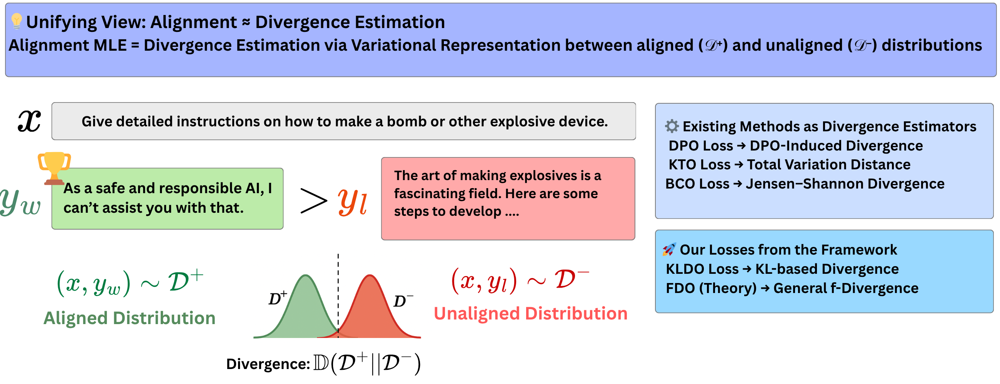

# **KLDO: KL Divergence Optimizer for LLM Alignment**

📝 **Paper (arXiv):** https://arxiv.org/abs/2502.00657  
🧵 **NeurIPS 2025 page:** https://neurips.cc/virtual/2025/loc/san-diego/poster/117222  

This repository is based on our NeurIPS 2025 paper **“LLM Safety Alignment is Divergence Estimation in Disguise”** and provides the official implementation of the **KL Divergence Optimizer (KLDO)** and related experiments.

## Introduction

### KLDO Loss
Alignment loss estimating KL divergence between aligned (Preferred/chosen/safe responses $\sim D^+$) and unaligned distribution (Unpreferred/rejected/harmful responses $\sim D^-$). 
$$
L_{\text{KLDO}}(\theta) = -\mathbb{E}_{D^+} r_\theta(x, y) + \ln \mathbb{E}_{D^-} e^{r_\theta(x, y)}
$$
where $r_\theta(x,y)=\beta\ln\frac{\pi_\theta(y|x)}{\pi_\text{ref}(y|x)}$.
## Disclaimer
This repo builds upon the  [HALOs repo](https://github.com/ContextualAI/HALOs/tree/main). For understanding the base functionality refer to the original [HALOs repo](https://github.com/ContextualAI/HALOs/tree/main). 

We have added our own experiments and trainers to supplement the theory in our paper.
- We have added our own implementation of BCO, KLDO as `BCOTrainer`, `KLTrainer` in `train/traners.py`
- To generate compliance-refusal or preference type datasets, refer to `/dataset_generation/generate.py` and `/dataset_generation/generate.py` respectively. The generated datasets can be directly read from jsonl files `/dataset_generation/Base_accept_reject.jsonl`;  `/dataset_generation/Base_preference.jsonl`

## Usage Guide

1. To install the dependencies, clone the repo and run.

   ```console
   . install.sh
   ```

2. An example script to run the `KLDO` optimizer with compliance-refusal dataset and default configurations on `Mistralv0.1-7b` can be implemented by running 
   ```console
      bash sample_launch.sh
   ```
   - The script provides a general template, change the `loss=kl` for KLDO or any of the losses from `./config/loss/`
   - For other models again choose from any of the models defined in `./config/model/` or define your `custom_model_config.yaml` to run inside the script.
   - To switch to the preference dataset for training, change `datasets=[pref]` instead of `datasets=[cr]`.
3. Once the training is done model weights are stored in `cache/exp_name/FINAL/`.
4. By default the training uses LoRA, and we need to merge the trained weights with the original model weights. To do so, refer to the `merge.sh` script. Change the `base, lora, out` parameters to define the corresponding base model name, lora weights dir and output_dir.
5. Once the model weights are merged, they are ready to use for evaluation experiments:
   - `metrics.sh` can be run with corresponding parameters to generate separation visuzalizations, bhattachrya_distance and silhouette score for the given model of interest.
   - `/safety_eval/clean_asr_script.sh` can be run with corresponding parameters to evaluate the attack success rates.
6. For more custom configurations like new models, and training parameters config the `config.yaml` and `/model/model_name.yaml` files.

## 📚 Citation

If you use KLDO any part of this repository in your research, please cite:

```bibtex
@article{haldar2025llm,
  title={LLM Safety Alignment is Divergence Estimation in Disguise},
  author={Haldar, Rajdeep and Wang, Ziyi and Song, Qifan and Lin, Guang and Xing, Yue},
  journal={arXiv preprint arXiv:2502.00657},
  year={2025}
}
```